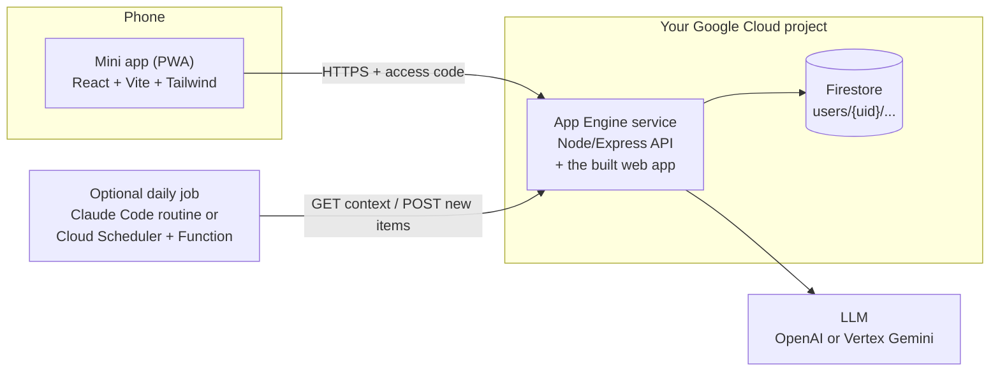

# Mini apps

**Personal software you actually use every day, built with Claude Code in an evening, for about
$0–5 a month.**

This repo contains a [Claude Code skill](skills/mini-apps/SKILL.md) that teaches Claude how to
build, deploy and improve a *mini app*: a small, single-purpose app that lives on your phone's home
screen, knows your preferences, and gets better the more you use it. You describe what you need in
plain language; Claude writes a spec, builds the app with a few parallel sub-agents, deploys it to
your own Google Cloud project and sends you a link.

- [What is a mini app?](#what-is-a-mini-app)
- [Two real examples](#two-real-examples)
- [How it works](#how-it-works)
- [Users and logins: three tiers](#users-and-logins-three-tiers)
- [Getting started (no technical experience needed)](#getting-started-no-technical-experience-needed)
- [Install the skill](#install-the-skill)
- [Your first mini app in one evening](#your-first-mini-app-in-one-evening)
- [Example prompts](#example-prompts)
- [FAQ](#faq)
- [Inspiration: ten more ideas](#inspiration-ten-more-ideas)
- [How these apps were built](#how-these-apps-were-built)
- [What's in this repo](#whats-in-this-repo)

## What is a mini app?

Most apps are built for millions of people, so they fit nobody exactly. A mini app is the opposite:

- **One job, done your way.** Your recipes, your supermarket, your news sources, your training plan.
- **On your phone.** It's a web app you "Add to Home Screen"; it opens full-screen like any other app.
- **It learns.** You give thumbs up/down, notes, or just chat ("less mushrooms, please"), and it
  updates its own notes about what you like.
- **It's yours.** Runs in your own Google Cloud project. No accounts to create, no ads, no
  subscription beyond the AI usage you choose.
- **Cheap.** It scales to zero when you're not using it. Hosting and database usually fit in
  Google's free tier; the AI calls cost cents to a few dollars a month.
- **Built in an evening, improved in minutes.** You describe changes in a sentence and Claude ships
  them.

## Two real examples

Both are in daily use and open source.

### 🍳 Two Pans: dinner for two, the lazy way
[github.com/ThomasVrancken/meals](https://github.com/ThomasVrancken/meals)

A meal-recommendation app for me and my partner. It suggests dinners that fit our style (fast, at
most two pans, pre-cut vegetables), lets us pick a few for the week, merges the ingredients into one
shopping list sorted by the walking order of our supermarket, remembers what we cooked and how we
liked it, and has a chat that can change anything: *"we don't like zucchini much"*, *"last night we
made the curry with coconut cream and peanuts, it was great"*, *"add milk to the list"*. Every few
ratings it rewrites its own "learned from feedback" notes.

### 📰 Thoughtstream: a newsfeed that learns
[github.com/ThomasVrancken/thoughtstream](https://github.com/ThomasVrancken/thoughtstream)

A personal learning newsfeed. Every morning a scheduled job researches a list of sources and
pushes a handful of genuinely new stories into a queue I scroll on my phone. I steer it in plain
language (*"more robotics, less crypto"*), ask questions about any story (answered with web search),
and can invite a few friends who get their own feed.

## How it works



- **Frontend:** a mobile-first Progressive Web App (React, Vite, Tailwind) with an offline-friendly
  service worker.
- **Backend:** a small Node.js/Express API on **Google App Engine Standard** (smallest instance,
  scales to zero). It also serves the web app, so there is one URL and one deploy.
- **Data:** **Firestore**, organised per user from day one.
- **AI:** OpenAI (Responses API) or Google's Gemini on Vertex AI, always with structured outputs; an
  autonomous chat agent that edits your data with tools; a reflection step that turns feedback into
  "learned" notes.
- **Process:** Claude writes `SPEC.md` first (the contract), then a backend and a frontend
  sub-agent build in parallel, then Claude integrates, deploys, verifies the live app, and writes
  `CLAUDE.md` with everything it learned for next time.

Cloud Run is described in the skill as an alternative host, but App Engine Standard is what both
apps run on.

## Users and logins: three tiers

Every mini app stores data per user from the start, so you can move up a tier later without
migrating anything.

| Who uses it | How you log in | Status |
|---|---|---|
| **Just you, or you + your household** | One secret access code (or a magic link `…/?code=…`). Everyone who has it shares the same data. | Used by both apps |
| **You + a few invited friends** | You create invite links; each friend gets their own data and per-device login links. You can pause accounts; AI usage has daily limits. | Used by Thoughtstream |
| **Anyone who signs up** | Firebase Authentication (email/password or Google). | Documented and templated, not yet battle-tested |

## Getting started (no technical experience needed)

You'll install a handful of free tools once. It takes 20–40 minutes. **Tip:** once Claude Code is
installed (step 2), you can let it do the rest. Literally type:

> *Help me install everything the mini-apps skill needs, one step at a time.*

### 1. Open a terminal

A terminal is a window where you type commands instead of clicking.

- **Mac:** press `Cmd + Space`, type **Terminal**, press Enter.
- **Windows:** press the Windows key, type **PowerShell**, press Enter.

To run a command below, copy it, paste it into the terminal, and press Enter.

### 2. Install Claude Code

You need a paid Claude plan (Pro, Max, Team or Enterprise) or an Anthropic Console account.

- **Mac / Linux:**
  ```bash
  curl -fsSL https://claude.ai/install.sh | bash
  ```
- **Windows (PowerShell):**
  ```powershell
  irm https://claude.ai/install.ps1 | iex
  ```

Alternatives: `brew install --cask claude-code` on a Mac, or the **Claude desktop app**
(download from [claude.com/download](https://claude.com/download)), which includes Claude Code.
Official instructions: [Claude Code docs](https://docs.claude.com/en/docs/claude-code).

Start it by typing `claude` and follow the login prompt.

### 3. Install the developer tools

**Mac:** first install [Homebrew](https://brew.sh), the Mac package manager:

```bash
/bin/bash -c "$(curl -fsSL https://raw.githubusercontent.com/Homebrew/install/HEAD/install.sh)"
```

Then:

```bash
brew install node git gh
brew install --cask gcloud-cli
```

**Windows:** install with `winget` (built into Windows 10/11), then open a new PowerShell window:

```powershell
winget install OpenJS.NodeJS.LTS
winget install Git.Git
winget install GitHub.cli
```

and install the Google Cloud CLI with the installer from
[cloud.google.com/sdk/docs/install](https://cloud.google.com/sdk/docs/install).
(Git for Windows also gives Claude Code a Bash shell, which it works best with.)

You need **Node.js 22 or newer**.

### 4. Connect GitHub

Create a free account at [github.com](https://github.com) if you don't have one, then:

```bash
gh auth login
```

Choose GitHub.com, HTTPS, and log in with your browser. Claude will keep each app's code in a
private repository there.

### 5. Set up Google Cloud

1. Go to [console.cloud.google.com](https://console.cloud.google.com) and sign in with a Google
   account. New accounts usually get free trial credits.
2. Create a **project** (top bar → project picker → New project). Note its **project ID**.
3. Turn on **billing** for the project (Billing → Link a billing account). App Engine requires it,
   even though a personal app mostly stays within the free tier.
4. Create a **budget alert** (Billing → Budgets & alerts), for example €5/month with alerts at 50%,
   100% and 150%. Budgets warn you; they don't stop spending.
5. In the terminal, log in twice (the second one lets apps on your computer talk to Google Cloud):
   ```bash
   gcloud init
   gcloud auth application-default login
   ```

Claude enables the specific services (App Engine, Firestore, ...) for you when it builds the first
app, after checking what already exists.

### 6. Get an AI key (or skip it)

- **OpenAI:** create a key at [platform.openai.com](https://platform.openai.com/api-keys), add a
  few dollars of credit, and set a monthly limit. Save the key in a file on your computer, e.g.
  `~/secrets/openai.env`, as `OPENAI_API_KEY=sk-...`.
- **No key:** use Google's Gemini through Vertex AI, which bills to your Google Cloud project.
  Tell Claude "use Vertex Gemini".

**Never paste a key into a chat, a GitHub issue, or any public place.** Just tell Claude *where the
file is*; it copies the key into the app's private, git-ignored config.

### 7. Check that everything works

```bash
claude --version
node -v                 # v22 or higher
git --version
gh auth status
gcloud auth list
gcloud config get-value project
gcloud auth application-default print-access-token > /dev/null && echo "Google login OK"
```

`claude doctor` gives a more detailed Claude Code health check.

## Install the skill

```bash
git clone https://github.com/ThomasVrancken/mini-apps.git
```

Then make the skill available to Claude Code, either for all your projects:

```bash
mkdir -p ~/.claude/skills
cp -R mini-apps/skills/mini-apps ~/.claude/skills/
```

or for one project only, by copying it into that project's `.claude/skills/` folder. If you prefer
to stay up to date with `git pull`, you can symlink instead of copying
(`ln -s "$PWD/mini-apps/skills/mini-apps" ~/.claude/skills/mini-apps`); if your Claude Code doesn't
pick up the symlink, copy the folder.

Restart Claude Code. Asking for a "mini app" triggers the skill automatically, or say
*"use the mini-apps skill"*.

## Your first mini app in one evening

1. **Make a folder and start Claude Code there.**
   ```bash
   mkdir -p ~/projects && cd ~/projects
   claude
   ```
2. **Brain-dump what you need** (see [example prompts](#example-prompts)). Talk about the problem,
   your habits, who uses it, and the handful of things it must do. Mention your Google Cloud project
   ID and where your AI key file is. End with *"Use the mini-apps skill, deploy it and send me the
   link."*
3. **Let Claude work.** It will check your Google Cloud project (read-only first), write `SPEC.md`,
   create a private GitHub repo, start a backend and a frontend sub-agent in parallel, put the pieces
   together, test them, deploy, and check the live site. This takes a while; on a Mac the skill keeps
   the computer awake during long runs.
4. **Open the link on your phone.** Claude gives you the app's address and a way to copy your
   personal login link without it appearing in the chat. On iPhone: Safari → Share → **Add to Home
   Screen**. On Android: Chrome menu → **Install app**.
5. **Use it for a day, then iterate.** Small feedback rounds work best:
   - *"Add a shopping list sorted by my supermarket's aisle order: spices, fruit, vegetables, fresh
     pasta, meat, cheese, bread, rice and pasta, world food, dairy, drinks."*
   - *"When I open a recipe, let me ask a question about it without changing it."*
   - *"The suggestions keep using ingredients my supermarket doesn't sell. Stick to mainstream
     brands."*
   - *"Make the cards more compact and show the cooking time."*

   Claude updates the spec, changes the code, tests, redeploys, and notes anything tricky in the
   app's `CLAUDE.md` so the next session starts smarter.

## Example prompts

### What makes a good prompt

> - **The problem and your habits.** What annoys you today, what you do instead, what "good" looks like.
> - **Who uses it.** Just you, you and a partner (shared data), invited friends, or anyone.
> - **The core loop.** The thing you'll do every day, step by step.
> - **A handful of must-haves.** Three to six features. Not twenty.
> - **Your constraints and tastes.** Budget, language, tone, look and feel, things to avoid.
>
> You don't need to name any technology; the skill decides that. The Two Pans prompt was a long
> spoken brain-dump, and that works fine, but a few paragraphs are enough. Then iterate in small
> rounds.

### 1. Meal planner for two (a condensed version of the Two Pans prompt)

```text
My partner and I cook dinner most nights and always struggle to decide what to make. We want a
meal-recommendation app on our phones, sharing the same data. Our style: speed over quality, max two
pans (a pot for rice or pasta, a wok for the rest), pre-cut vegetable bags, jarred sauces and curry
pastes welcome. We love curries, a spicy bolognese-like "red sauce", and tortellini with cream sauce.
We shop at my local supermarket, so only use ingredients a regular store carries.
Features: suggest a few recipe ideas at a time (with an optional hint like "something with salmon");
pick some for the week and get one merged shopping list; log what we cooked and whether we liked
it; learn from our feedback; and a chat that can change anything: preferences, recipes, the week,
the history. Use the mini-apps skill, deploy it and send me the link.
```

### 2. Workout log with an AI coach

```text
I go to the gym three times a week but I never remember what I lifted last time, and my progress has
stalled. I want a training log on my phone, just for me. Before a session I'd like to open the app and
see today's workout, with the weights from last time and a small suggested progression. During the
session I tick off sets quickly (big buttons, works one-handed). After the session I rate how it felt.
Features: a plan of 3 rotating workouts I can edit; quick set logging; history per exercise with a
simple chart; an AI coach I can chat with ("my shoulder hurts, swap the overhead press", "I only have
30 minutes today") that adjusts the plan itself; a weekly summary of what improved. Keep it minimal
and dark-themed. Use the mini-apps skill, deploy it and send me the link.
```

### 3. Household chores and groceries for flatmates

```text
I live with three flatmates and we keep arguing about chores and running out of basics. I want a shared
household app on our phones. Each flatmate has their own login (invite links are fine, no passwords),
but we share the chores and the grocery list. Features: a weekly chores rotation that assigns tasks
fairly and lets someone swap a task; a shared grocery list where anyone can add items by typing or by
telling the chat ("we're out of olive oil and dish soap"); a "who paid for what" log with a simple
balance; a gentle weekly summary of who did what. I'm the admin and can invite or remove people.
Friendly, colourful, not childish. Use the mini-apps skill, deploy it and send me the link.
```

### 4. Bedtime stories that remember the characters

```text
Every night I make up a bedtime story for my two kids (5 and 8) and I'm running out of ideas. I want a
bedtime story app on my phone, just for our family. The kids have recurring favourite characters: a
brave hedgehog, a forgetful dragon, and their own cuddly toys. Features: generate a 5-minute story from
a few taps (characters, a place, a mood like "calm" or "funny", an optional lesson); the app remembers
the characters and what happened in earlier stories so it can continue a saga; a read-aloud friendly
layout with big text and a dark, warm night mode; a thumbs up/down after each story so it learns what
the kids love; a character sheet I can edit or change by chatting. Stories must always be gentle and
age-appropriate. Use the mini-apps skill, deploy it and send me the link.
```

### 5. Book club and reading notes (people sign up)

```text
I run a small book club and we lose track of what we read and what we thought. I want a reading app
where members create their own account (email or Google sign-in), because people join over time.
Features: each person has a reading list and writes short notes and a rating per book; a shared club
page with the current book, the next meeting date, and everyone's ratings once they've finished it; an
AI that turns my notes into a few discussion questions before each meeting; suggestions for the
next book based on what the group liked; per-person daily limits on AI use so costs stay low.
Calm, bookish design. Use the mini-apps skill with Firebase accounts, deploy it and send me the link.
```

### 6. Plant care with photo diagnosis

```text
I have about twenty houseplants and I either forget to water them or overwater them. I want a plant
care app on my phone, for me and my partner (shared data). Features: a list of my plants with a photo,
location and watering interval; a "today" view of what needs water, with one tap to mark it done; the
AI suggests a watering interval and light needs when I add a plant by name; I can upload a photo of a
sick-looking leaf and get a likely cause and what to do; the app learns from my notes ("the fern
dried out again") and adjusts the schedule. Green, fresh look. Use the mini-apps skill, deploy it and
send me the link.
```

## FAQ

**What does it cost?**
With the defaults (smallest App Engine instance, scale to zero, one or two instances max), hosting
and Firestore usually stay in Google's free tier for personal use. The real cost is AI usage:
typically cents to a few dollars a month, depending on how much you generate and chat. Set a budget
alert in Google Cloud and a monthly limit with your AI provider. Claude Code itself needs a paid
Claude plan.

**Can I share it with my partner or family?**
Yes. In the simplest tier everyone uses the same access code and shares the data. Send them the
magic link privately (it contains the code). For separate data per person, ask for invite links;
for public sign-up, ask for Firebase accounts.

**How secure is it?**
For the shared-code tier: the app is served over HTTPS, every API call needs the secret code, and the
code is compared in constant time. But whoever has the code (or an unlocked phone with the app) has
full access, there's no per-person audit trail, and changing the code means everyone re-enters it.
Good for personal lists and preferences; don't store passwords, health records or anything
seriously sensitive. Secrets stay in files that are never committed to Git. Anyone you give access
to your Google Cloud project can see the app's configuration, so keep the project to yourself.

**Can I switch AI provider later?**
Yes. Each app has a thin AI wrapper, so switching between OpenAI and Gemini on Vertex AI is a
contained change: ask Claude to do it. The autonomous chat agent is proven on OpenAI; on Gemini it
needs porting and testing.

**Do I need to know how to code?**
No, but it helps to read what Claude writes in `SPEC.md` and to test the app properly on your phone.
You're the product owner: your feedback is what makes it good.

**Why Google Cloud and not something else?**
Scale-to-zero hosting, a free-tier database, and Gemini without API keys, all in one project that
costs nothing when idle. The patterns (spec first, per-user data, structured AI outputs, chat agent)
carry over to other hosts.

**Can I run several mini apps in one Google Cloud project?**
Yes, that's how the two examples run: each app is its own App Engine service with its own URL, and
their data is kept apart with collection prefixes. The skill never touches the other apps.

## Inspiration: ten more ideas

| Idea | What the AI does |
|---|---|
| 🏋️ **Workout log with a coach** | Plans the next session from your history, adapts to "only 30 minutes" or a sore shoulder, summarizes weekly progress. |
| 🪴 **Plant-watering tracker** | Suggests care schedules per plant, diagnoses a photo of a sick leaf, adjusts watering from your notes. |
| 🌙 **Kids' bedtime stories** | Writes gentle stories with recurring characters, continues sagas, learns which stories land. |
| 🎁 **Gift-idea tracker** | Captures hints people drop during the year and turns them into gift shortlists before birthdays. |
| 📚 **Reading list and book notes** | Summarizes your highlights, links ideas across books, suggests what to read next. |
| 📓 **Habit and mood journal** | Writes a short weekly reflection from your entries and spots patterns (sleep, exercise, mood). |
| 🧳 **Travel packing lists** | Builds a list from destination, weather and trip type, and learns what you always forget. |
| 🧹 **Household chores rotation** | Assigns chores fairly, handles swaps, and takes requests by chat ("I'll do the bins this week"). |
| 🗣️ **Language flashcards from your own sentences** | Turns things you actually said or read into cards, explains mistakes, schedules reviews. |
| 🍷 **Wine or beer tasting notes** | Structures your tasting notes, learns your palate, and tells you what to try next. |

## How these apps were built

**Thoughtstream** grew over several months. It started as an agent skill that wrote a daily news digest to
markdown files, became a phone app on Google Cloud (App Engine + Firestore) fed each morning by a
scheduled Claude Code routine, gained a Gemini-powered fallback job that only runs when the routine
didn't, a plain-language way to edit its taste settings, and finally invite links for friends. Most
of the hard-won lessons in this skill come from that app: the build script that must install the
frontend's dev dependencies, the missing PostCSS config that silently left the app unstyled, the
cached `index.html` that broke the app after a redeploy, and the dedup key that merged distinct
stories.

**Two Pans** was the test of whether those lessons transfer. The request was a long spoken brain-dump
about how we cook and shop. Claude turned it into `SPEC.md`, then a backend agent and a frontend
agent built their halves in parallel against that spec without ever talking to each other. At
integration, a full walkthrough found zero contract mismatches and all 57 API smoke checks passed.
It was deployed as a second service in the same Google Cloud project, next to the newsfeed, with
prefixed database collections so the two can't collide. The spec was committed at 21:20 and the
deployed app at 22:04 the same evening. The next day's feedback round added recipe Q&A, cooking tips,
"where to find it" hints, a manual grocery list, and a shopping list sorted by the actual walking
order of our supermarket.

This skill packages that process so the next app starts where these two ended.

## What's in this repo

```
skills/mini-apps/
  SKILL.md                    the playbook Claude follows
  reference/
    architecture.md           the reference architecture and folder layout
    gcp-setup.md              one-time Google Cloud setup, deploy, verification, budgets, Cloud Run
    ai-patterns.md            structured outputs, chat agent loop, preference editing, reflection
    pwa.md                    manifest, icons, iOS details, service worker, login UX
    users-and-auth.md         the three login tiers
    firebase-auth.md          self sign-up with Firebase Authentication
    scheduled-jobs.md         daily generation jobs
  templates/                  copy-ready starter files (server, client, config, SPEC/CLAUDE templates)
```

## License

[MIT](LICENSE) © 2026 Thomas Vrancken
