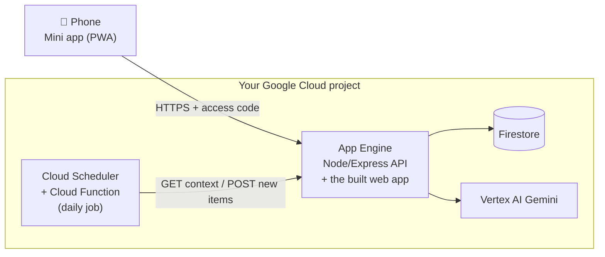

# Mini apps

**Personal software you actually use every day, built with Claude Code in an evening, for about
$0–5 a month.**

This repo contains a [Claude Code skill](skills/mini-apps/SKILL.md) that teaches Claude how to
build, deploy and improve a *mini app*: a small, single-purpose app that lives on your phone's home
screen, knows your preferences, and gets better the more you use it. You describe what you need in
plain language; Claude writes a spec, builds the app with a few parallel sub-agents, deploys it to
your own Google Cloud project and sends you a link.

- [What is a mini app?](#what-is-a-mini-app)
- [Two real examples](#two-real-examples)
- [How it works](#how-it-works)
- [Users and logins: three tiers](#users-and-logins-three-tiers)
- [Getting started](#getting-started)
- [Example prompts](#example-prompts)
- [What's in this repo](#whats-in-this-repo)
- [License](#license)

## What is a mini app?

Most apps are built for millions of people, so they fit nobody exactly. A mini app is the opposite:

- **One job, done your way.** Your recipes, your supermarket, your news sources, your training plan.
- **On your phone.** It's a web app you "Add to Home Screen"; it opens full-screen like any other app.
- **It learns.** You give thumbs up/down, notes, or just chat ("less mushrooms, please"), and it
  updates its own notes about what you like.
- **It's yours.** Runs in your own Google Cloud project. No accounts to create, no ads, no
  subscription beyond the AI usage you choose.
- **Cheap.** It scales to zero when you're not using it. Hosting and database usually fit in
  Google's free tier; the AI calls cost cents to a few dollars a month.
- **Built in an evening, improved in minutes.** You describe changes in a sentence and Claude ships
  them.

## Two real examples

Both are in daily use and open source.

### 🍳 Two Pans: dinner sorted, the lazy way
[github.com/ThomasVrancken/meals](https://github.com/ThomasVrancken/meals)

A meal planner for a household that cooks dinner most nights and wants it fast. It suggests meals
that fit the house style (quick, at most two pans, pre-cut vegetables, jarred sauces welcome), lets
everyone pick a few for the week, merges the ingredients into one shopping list, remembers what was
cooked and how it went, and has a chat that can change anything: *"we don't like zucchini much"*,
*"last night's curry with coconut cream and peanuts was great"*, *"add milk to the list"*. Every
few ratings it rewrites its own "learned from feedback" notes.

### 📰 Thoughtstream: a newsfeed that learns
[github.com/ThomasVrancken/thoughtstream](https://github.com/ThomasVrancken/thoughtstream)

A personal learning newsfeed. Every morning a scheduled job researches a list of sources and
pushes a handful of genuinely new stories into a queue to scroll through on your phone. Steer it in
plain language (*"more robotics, less crypto"*), ask questions about any story (answered with web
search), and invite a few friends who get their own feed.

## How it works



Everything lives inside one Google Cloud project: **App Engine** serves the API and the built PWA
(one URL, one deploy), **Firestore** holds the data organised per user, and **Vertex AI Gemini**
handles the AI features. An optional daily job — **Cloud Scheduler** triggering a **Cloud
Function** — fetches new content on a schedule and posts it back into the app's own API.

Two common swaps: the LLM can be an external provider such as **OpenAI** instead of Vertex AI, and
the daily job can be a **Claude Code routine** (a scheduled cloud agent) that calls the app's API
directly instead of a Cloud Function.

## Users and logins: three tiers

Every mini app stores data per user from the start, so you can move up a tier later without
migrating anything.

| Who uses it | How you log in | Status |
|---|---|---|
| **Just you, or you + your household** | One secret access code (or a magic link `…/?code=…`). Everyone who has it shares the same data. | Used by both apps |
| **You + a few invited friends** | You create invite links; each friend gets their own data and per-device login links. You can pause accounts; AI usage has daily limits. | Used by Thoughtstream |
| **Anyone who signs up** | Firebase Authentication (email/password or Google). | Not yet battle-tested |

## Getting started

<!-- TODO: screenshot of Claude desktop, Code tab -->

1. **Install Claude Code.** If you're not very comfortable with a terminal, the easiest way in is
   the [Claude desktop app](https://claude.ai/download): install it, sign in, and open the **Code**
   tab. Comfortable with a terminal or an IDE instead? See the
   [Claude Code docs](https://code.claude.com/docs) for the CLI and other options.

2. **Set up a Google Cloud project** with billing enabled — Claude will use it to host your app for
   about $0–5/month. See
   [Creating and managing projects](https://cloud.google.com/resource-manager/docs/creating-managing-projects)
   (new accounts usually get [free trial credits](https://cloud.google.com/free)).

3. **Ask Claude Code to build your app.** Open a chat (the desktop app's Code tab, or `claude` in a
   terminal) and describe what you want, for example:

   ```text
   Use the mini-apps skill from https://github.com/ThomasVrancken/mini-apps to build me a workout
   log with an AI coach. Deploy it and send me the link.
   ```

   The first time you ask for a "mini app", Claude installs the skill itself and helps install any
   tools it's missing (gcloud, GitHub CLI, Node). Prefer to install the skill yourself? `git clone`
   this repo, then `cp -R mini-apps/skills/mini-apps ~/.claude/skills/`.

## Example prompts

### What makes a good prompt

- **The problem and your habits.** What annoys you today, and what "good" looks like.
- **Who uses it.** Just you, you and someone else (shared data), invited friends, or anyone.
- **The core loop.** The one thing you'll do every day, step by step.
- **A handful of must-haves.** Three to six features, not twenty.
- **Your constraints and tastes.** Budget, language, tone, look and feel, things to avoid.

### 🏋️ Workout log with an AI coach

```text
I go to the gym three times a week but never remember what I lifted last time, and progress has
stalled. I want a training log just for me. Before a session, show today's workout with last
time's weights and a suggested progression; during the session let me tick off sets fast with big,
one-handed buttons; after, let me rate how it felt. Features: a plan of 3 rotating workouts I can
edit, quick set logging, a history chart per exercise, an AI coach I can chat with ("my shoulder
hurts, swap the overhead press") that adjusts the plan, and a weekly summary of progress. Minimal,
dark-themed. Use the mini-apps skill, deploy it and send me the link.
```

### 🧹 Household chores and groceries for flatmates

```text
I live with three flatmates and we keep arguing about chores and running out of basics. I want a
shared household app on our phones: each flatmate has their own login (invite links, no
passwords), sharing the chores and the grocery list. Features: a weekly chores rotation that
assigns tasks fairly and lets someone swap a task; a shared grocery list anyone can add to by
typing or telling the chat ("we're out of olive oil and dish soap"); a "who paid for what" log with
a simple balance; a gentle weekly summary of who did what. I'm the admin and can invite or remove
people. Friendly, colourful, not childish. Use the mini-apps skill, deploy it and send me the link.
```

### ✈️ Trip planner

```text
A few of us are planning a trip together and it's turning into a mess of chat threads and shared
docs. I want a trip planner we can all open on our phones. Features: a day-by-day itinerary anyone
can edit, shared with everyone going; AI suggestions for activities and restaurants based on the
destination, dates and what we tell it we like ("more hiking, fewer museums"); a packing list that
adapts to the weather and trip length, with checkboxes everyone can tick; a chat to ask "what's the
plan for Thursday?" or add a new stop. Keep it light and easy to use on the move. Use the mini-apps
skill, deploy it and send me the link.
```

### 💸 Expense tracker (rebuild a well-known app your way)

```text
I want my own version of a Splitwise-style expense tracker, built the way I'd actually design it,
not the way the app decided. Just for me and my household, sharing the same data. Features:
logging an expense in a couple of taps (amount, category, who paid, split or not); a monthly
overview by category with a simple chart; a running "who owes who" balance; an AI chat I can ask
things like "how much did we spend on restaurants this month?" or tell "add a $40 grocery run,
split evenly". No ads, no subscription, no account to create, just our own numbers. Use the
mini-apps skill, deploy it and send me the link.
```

### 🗂️ Personal admin assistant

```text
I keep losing track of bills, contracts and renewal dates, and paperwork is scattered everywhere.
I want a personal admin assistant on my phone, just for me. Features: a list of bills,
subscriptions and contracts with amounts and renewal or due dates; reminders before something is
due; a note of where the actual documents live; an AI chat where I can just say "add the car
insurance, renews every March, around $600" or ask "what's due this month?" and have it file or
answer correctly. Simple, calm, no clutter. Use the mini-apps skill, deploy it and send me the
link.
```

## What's in this repo

[`skills/mini-apps/SKILL.md`](skills/mini-apps/SKILL.md) is the whole playbook: what a mini app
is, a menu of building blocks to choose from (front end, hosting, data store, auth, LLM access,
scheduled jobs), the AI patterns that make these apps good, and the build process, plus a short
list of hard-won warnings. It's deliberately high-level — it doesn't dictate a stack, a file
layout, or exact commands, so Claude makes its own low-level choices for your app.
[`skills/mini-apps/reference/gotchas.md`](skills/mini-apps/reference/gotchas.md) has a few more
concrete deployment traps, for when you're using pieces close to what the two example apps use.

## License

[MIT](LICENSE)
